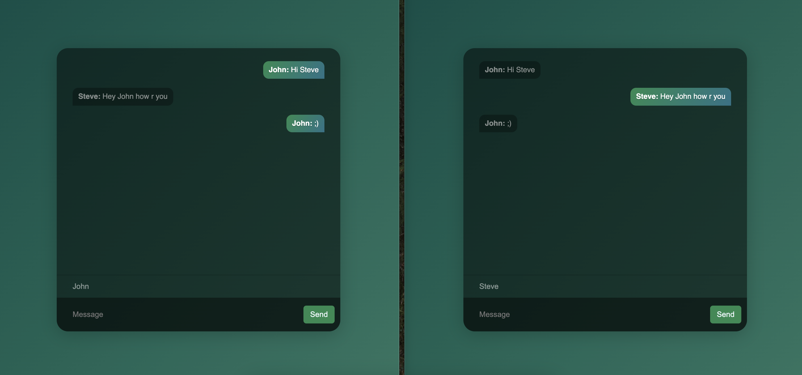

# Photos
Chats
:-------------------------:


# EN - Chat Socket Application

This project is a real-time chat application. It is developed using Node.js, Express, and Socket.IO, allowing users to send and receive messages instantly.

## Features
- **Real-time Messaging**: Users can send and receive messages in real-time.
- **Typing Indicator**: Shows when a user is typing.
- **Message Alignment**: Messages sent by the user are aligned to the right.

## Setup
To run the project locally, follow these steps:

1. Clone this repository:
   ```bash
   git clone https://github.com/kemalgundogdu/chat-socket.git
   ```

2. Navigate to the project directory:
   ```bash
   cd chat-socket
   ```

3. Install the required dependencies:
   ```bash
   npm install
   ```

4. Start the project:
   ```bash
   node index.js
   ```

## Technologies Used
- **Node.js**: For the server-side runtime environment.
- **Express**: For handling HTTP requests and serving static files.
- **Socket.IO**: For real-time communication between the client and server.

## Contributing
If you would like to contribute, please submit a pull request or open an issue.

## License
This project is licensed under the MIT License.

---

# TR - Sohbet Soket Uygulaması

Bu proje, gerçek zamanlı bir sohbet uygulamasıdır. Proje, Node.js, Express ve Socket.IO kullanılarak geliştirilmiştir ve kullanıcıların anında mesaj göndermesini ve almasını sağlar.

## Özellikler
- **Gerçek Zamanlı Mesajlaşma**: Kullanıcılar gerçek zamanlı olarak mesaj gönderebilir ve alabilir.
- **Yazma Göstergesi**: Bir kullanıcının yazmakta olduğunu gösterir.
- **Mesaj Hizalaması**: Kullanıcı tarafından gönderilen mesajlar sağa hizalanır.

## Kurulum
Projeyi yerel ortamınızda çalıştırmak için aşağıdaki adımları izleyin:

1. Bu depoyu klonlayın:
   ```bash
   git clone https://github.com/kemalgundogdu/chat-socket.git
   ```

2. Proje dizinine gidin:
   ```bash
   cd chat-socket
   ```

3. Gerekli bağımlılıkları yükleyin:
   ```bash
   npm install
   ```

4. Projeyi başlatın:
   ```bash
   node index.js
   ```

## Kullanılan Teknolojiler
- **Node.js**: Sunucu tarafı çalışma ortamı için.
- **Express**: HTTP isteklerini işlemek ve statik dosyaları sunmak için.
- **Socket.IO**: İstemci ve sunucu arasında gerçek zamanlı iletişim için.

## Katkıda Bulunma
Katkıda bulunmak isterseniz, lütfen bir pull request gönderin veya bir issue açın.

## Lisans
Bu proje MIT Lisansı ile lisanslanmıştır.
